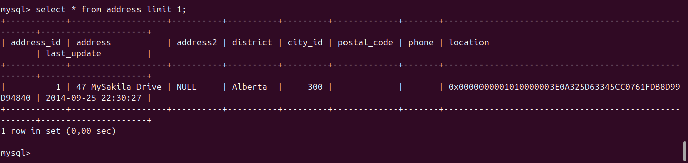
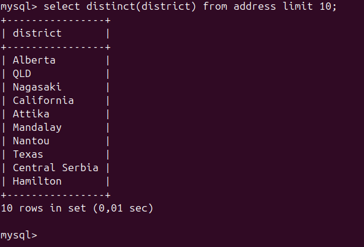
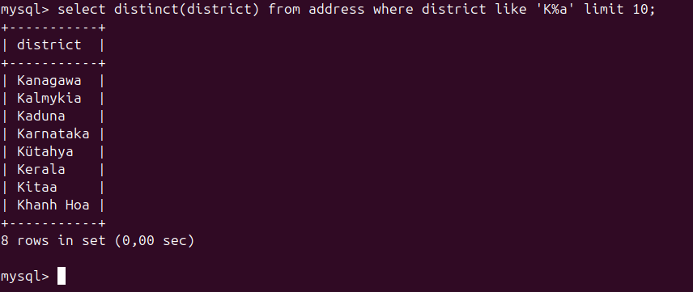
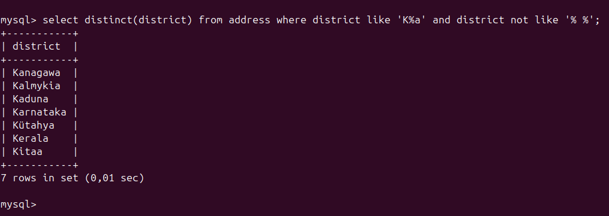
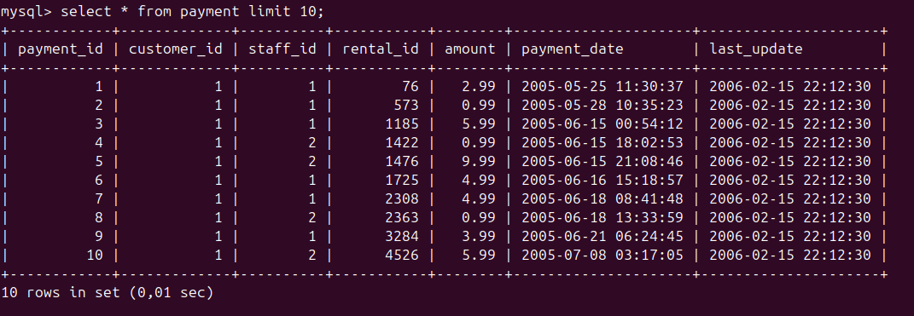
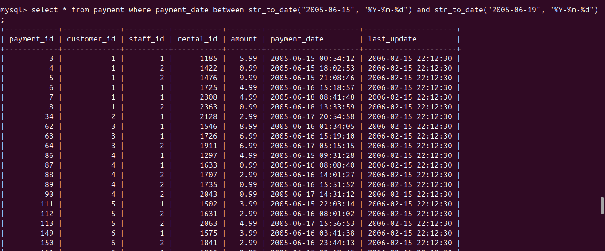
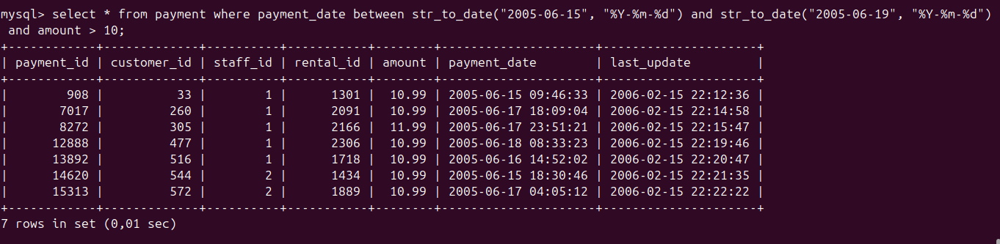
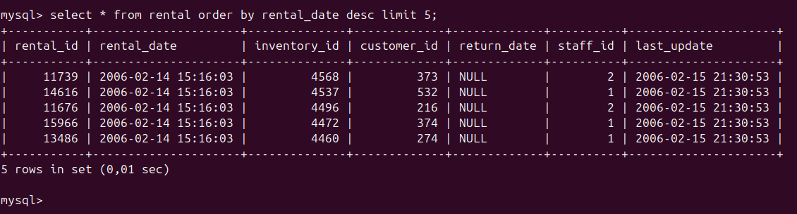
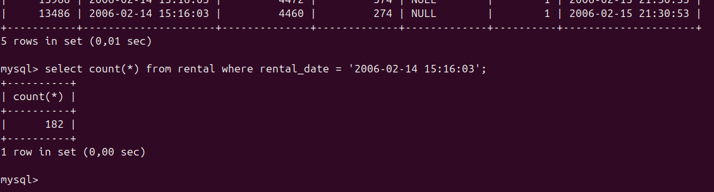
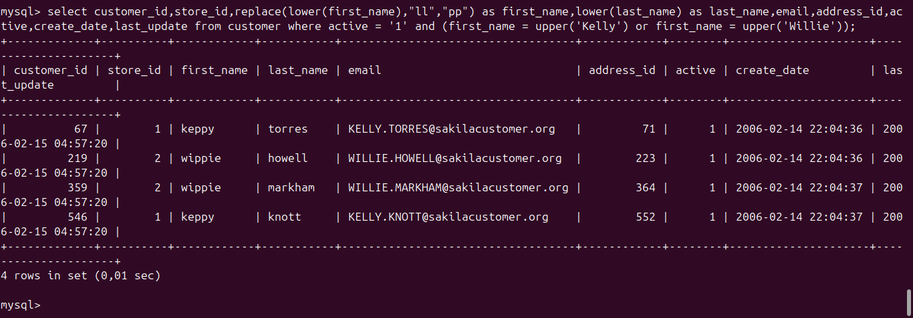

# Домашнее задание к занятию "SQL. Часть 1" - `Байков Михаил`

### Задание 1

Получите уникальные названия районов из таблицы с адресами, которые начинаются на “K” и заканчиваются на “a” и не содержат пробелов.

### Решение 1
1. Получаем рандомную строку из таблицы адресов для первичного анализа:
```
select * from address limit 1;
```

2. Уточняем запрос оставляя только уникальные округа(district):
```
select distinct(district) from address limit 10;
```
\
3. Уточянем запрос оставляя только округа которые начинаются на "К" и заканчиваются на "а"
```
select distinct(district) from address where district like 'K%a' limit 10;
```

4. Финализируем ограничивая выдачу округов без пробелов
```
select distinct(district) from address where district like 'K%a' and district not like '% %';
```



### Задание 2

Получите из таблицы платежей за прокат фильмов информацию по платежам, которые выполнялись в промежуток с 15 июня 2005 года по 18 июня 2005 года **включительно** и стоимость которых превышает 10.00.

### Решение 2
1. Получаем "тестовый" список платежей для первичного анализа: 
```
select * from payment limit 10;
```

2. Ограничиваем имеющийся "тестовый" запрос датами применяя функцию приведения строки к дате:
```
select * from payment where payment_date between str_to_date("2005-06-15", "%Y-%m-%d") and str_to_date("2005-06-19", "%Y-%m-%d") limit 10;
```

3. Ограничиваем "тестовый" запрос размером платежа более 10 получая финальную выдачу.
```
where payment_date between str_to_date("2005-06-15", "%Y-%m-%d") and str_to_date("2005-06-19", "%Y-%m-%d") and amount > 10;
```


### Задание 3

Получите последние пять аренд фильмов.

### Решение 3
```
select * from rental order by rental_date desc limit 5;
```


**Примечание**\
Данный вывод вроде бы подразумевается заданием, но является не корректным. Потому как с датой аренды "2006-02-14 15:16:03" 
имеется 182 строки:
```
select count(*) from rental where rental_date = '2006-02-14 15:16:03';
```


и сортировка по времени не позволяет однозначно сделать вывод о том какие 5 из них "последние".
Требуются дополнительные ограничения выдачи.


### Задание 4

Одним запросом получите активных покупателей, имена которых Kelly или Willie. 

Сформируйте вывод в результат таким образом:
- все буквы в фамилии и имени из верхнего регистра переведите в нижний регистр,
- замените буквы 'll' в именах на 'pp'.

### Решение 4

1. Получаем тестовый вывод из таблицы покупателей:
```
select * from customer limit 10;
```
2. Ограничиваем вывод активными покупателями:
```
select * from customer where active = '1' and limit 10;
```
3. Ограничиваем именами Kelly или Willie, поскольку в таблице имена указаны заглавными буквами на всякий случай используем функцию upper:
```
select * from customer where active = '1' and (first_name = upper('Kelly') or first_name = upper('Willie')) limit 10;
```
4. В выводе переводим все в нижний регистр и заменяем 'll' на 'pp'
```
select customer_id,store_id,replace(lower(first_name),"ll","pp") as first_name,lower(last_name),email,address_id,active,create_date,last_update from customer where active = '1' and (first_name = upper('Kelly') or first_name = upper('Willie'));
```

